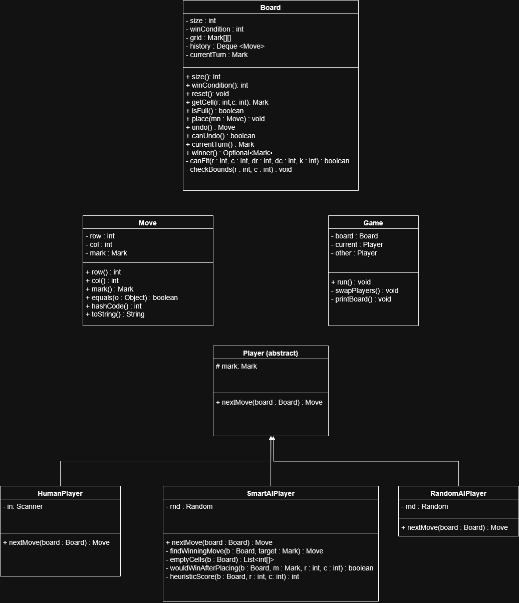

# CS 3560 Tic-Tac-Toe Assignment
**Group 12: Claire Chen, Ben Edwards**

## How to Run
1. Click the Green Code Button and Clone using the web URL in your IDE of choice
2. Run the file named "ConsoleApp.java" to start!

## Design Rationale
- Where did encapsulation prevent bugs?
  - (Placeholdeer)
- Why inheritance here (vs. strategy/composition)?
  - (Placeholder)
- What would you refactor if the rules changed to 4‑in‑a‑row on a 5×5 board?
  - (Placeholder)

## UML Diagram

## Test Results
- (Placeholder)
